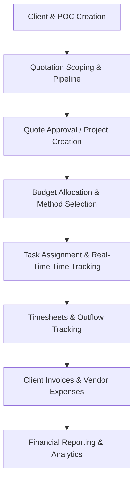

# Project Budgeting & Management Platform

A premium, end-to-end budgeting, quotation, and project tracking platform. This system is designed as a decoupled architecture featuring a robust **Django REST Framework (DRF)** backend and a highly responsive **React + TypeScript + Vite** frontend.

---

## 📌 Project Overview
This platform serves as a complete command center for professional service companies to manage their client relationships, scope out projects through quote generation, track progress in real-time, monitor budgets, and generate analytical financial reports.

### Start-to-End Business Flow


1. **Client Registration**: Companies register clients along with their points of contact (POCs).
2. **Quotation & Scoping**: Scope, quote name, timeline, services, prices, and in-house costs are negotiated in a Kanban-style pipeline.
3. **Project Instantiation**: Upon quote confirmation, the project is instantiated with its client metadata automatically linked.
4. **Budget Controls**: The project manager allocates budget parameters:
   - **Quoted Amount Mode**: Auto-populates budget metrics from the approved quote (revenue, labor cost limit, etc.).
   - **Manual Budget Mode**: Custom hour caps, revenue budgets, and billable limits.
5. **Task Execution**: Tasks are assigned to engineers, tracked using real-time timers (WebSockets), and submitted via weekly timesheets.
6. **Billing & Inflows**: Invoices are raised against client quotes, and vendor bills/expenses are logged.
7. **Reporting & Analytics**: Dashboards display metrics on margins, outflows, and collection rates, exportable as Excel or PDF.

---

## ⚙️ Architecture & Folder Structure

The project is structured into two main subdirectories:
- **`Project_Budgeting-BE-`** (Django REST Framework Backend)
- **`Project_Budgeting-FE-`** (React, TypeScript & Vite Frontend)

### Backend Modules (`Project_Budgeting-BE-`)
- **`accounts`**: Custom JWT authentication and account administration.
- **`client`**: Companies directory and client points of contact.
- **`product_group`**: Price lists, product/service directory, quotation pipeline, and quote items.
- **`Project`**: Core project records, budget settings, task allocations, WebSocket timer logs, and timesheets.
- **`finances`**: Client invoicing, payment receipts, vendor bills, and expenses.
- **`Reports`**: Analytical service layers aggregating metrics for the dashboard and reports templates.
- **`roles`**: Role-based access control rules.

### Frontend Components (`Project_Budgeting-FE-`)
- **`src/auth`**: JWT route guards and Redux authentication thunks.
- **`src/components`**: Reusable tables, forms, input fields, and UI modals (CreateProjectModal, AddTaskModal).
- **`src/pages`**:
  - `ProjectsScreen`: Main dashboard grouping active projects by company with budget KPIs.
  - `ProjectDetailsPage`: Tabbed screen showing tasks, timesheets, detailed budgets, invoices, and expenses.
  - `TaskManagement`: Interactive kanban board for developer tasks with real-time tracking timers.
  - `PipelineScreen`: Stage-by-stage Kanban view of sales quotations.
  - `ReportsPage`: Unified business intelligence page with dynamic filtering and file exporting.

---

## 🚀 Key Features

### 1. Advanced Project Budgeting
- Support for **Quoted Amounts** (syncs directly from quote lines) and **Manual Budgeting** (custom caps).
- Detailed metrics breakdown:
  - **Labor Outflow**: Auto-computed in real-time from timesheet logs and developer rates.
  - **Vendor & Other Outflows**: Summarized from approved vendor invoices and expense receipts.
  - **Headroom Tracking**: Interactive gauge bars showing the remaining budget headroom and alert indicators when nearing budget caps.

### 2. Interactive Task Management & Time Tracking
- Real-time task timers with Start/Pause/Stop control powered by Django Channels (WebSockets).
- Automatic calculation of consumed hours vs. allocated hours.
- Time tracking integration directly updating developer timesheets.

### 3. Financial Pipeline & Invoicing
- Quote building with dynamic service line items, quantities, and price book mappings.
- Seamless generation of client invoices directly from quote line items.
- Outgoing payment tracking to track external vendor obligations and expenses.

### 4. BI Dashboards & Exports
- Pivot tables displaying revenue, invoiced, received, outstanding, and margin percentages.
- Parallelized reporting service utilizing Django aggregates to minimize database overhead.
- Downloadable reports in **Excel (XLSX)** and **PDF** formats.

---

## 🛠️ Technology Stack

### Backend
- **Core**: Python 3.12+, Django 5.x
- **API Framework**: Django REST Framework (DRF)
- **Authentication**: DRF SimpleJWT (JSON Web Tokens)
- **Asynchronous Processing**: Celery & Redis
- **Real-Time Communications**: Django Channels (WebSockets)
- **Database**: SQLite (Development) / PostgreSQL (Production ready)

### Frontend
- **Core Framework**: React 19, TypeScript
- **Build Tool**: Vite
- **Styling**: Tailwind CSS
- **State Management**: Redux Toolkit & React-Redux
- **Icons & Graphics**: Lucide React, Recharts (Charts)

---

## 🏁 Getting Started

### Backend Setup
1. **Navigate to the backend directory**:
   ```bash
   cd Project_Budgeting-BE-
   ```
2. **Install dependencies**:
   ```bash
   pip install -r requirements.txt
   ```
3. **Set up your environment variables**:
   Create a `.env` file containing your configurations (JWT secrets, Redis connection, etc.).
4. **Apply database migrations**:
   ```bash
   python manage.py migrate
   ```
5. **Start the development server**:
   ```bash
   python manage.py runserver
   ```
6. **Start Celery worker** (for async email/status operations):
   ```bash
   celery -A myproject worker -l info
   ```

### Frontend Setup
1. **Navigate to the frontend directory**:
   ```bash
   cd Project_Budgeting-FE-
   ```
2. **Install node modules**:
   ```bash
   npm install
   ```
3. **Start the Vite dev server**:
   ```bash
   npm run dev
   ```
